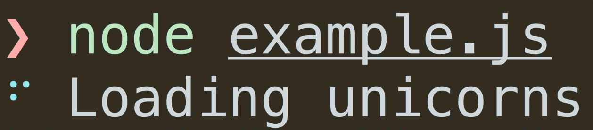
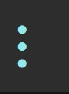
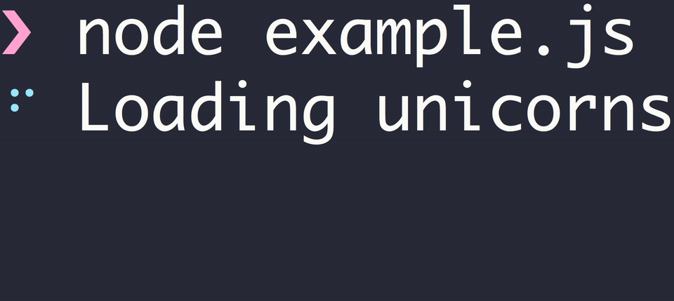

# @geek/spinner

> Geeky Terminal Spinner Utility


[](https://www.npmjs.com/package/@geek/spinner)
[](https://www.npmjs.com/package/@geek/spinner)
[](https://www.npmjs.com/package/@geek/tuspinnerrbo)




## Install

```
$ npm install --save @geek/spinner
```

## Usage

```js
const Spinner = require('@geek/spinner');

const spinner = Spinner('Loading unicorns').start();

setTimeout(() => {
	spinner.color = 'yellow';
	spinner.text = 'Loading rainbows';
}, 1000);
```


## API

It will gracefully not do anything when there's no TTY or when in a CI.

### Spinner([options|text])

If a string is provided, it is treated as a shortcut for [`options.text`](#text).

#### options

Type: `object`

##### text

Type: `string`

Text to display after the spinner.

##### spinner

Type: `string` `object`<br>
Default: `dots` 

Name of one of the [provided spinners](https://github.com/sindresorhus/cli-spinners/blob/master/spinners.json). See `example.js` in this repo if you want to test out different spinners.

Or an object like:

```js
{
	interval: 80, // optional
	frames: ['-', '+', '-']
}
```

##### color

Type: `string`<br>
Default: `cyan`<br>
Values: `black` `red` `green` `yellow` `blue` `magenta` `cyan` `white` `gray`

Color of the spinner.

##### hideCursor

Type: `boolean`<br>
Default: `true`

Set to `false` to stop Ora from hiding the cursor.

##### interval

Type: `number`<br>
Default: Provided by the spinner or `100`

Interval between each frame.

Spinners provide their own recommended interval, so you don't really need to specify this.

##### stream

Type: `WritableStream`<br>
Default: `process.stderr`

Stream to write the output.

You could for example set this to `process.stdout` instead.

##### enabled

Type: `boolean`<br>
Default: `false`

Force enabling of the spinner regardless of the `stream` not being run inside a TTY context and/or in a CI environment.

### Instance

#### .start([text])

Start the spinner. Returns the instance.

#### .stop([text])

Stop and clear the spinner. Returns the instance.

### .succeed([text])

Stop the spinner, change it to a green `✔` and persist the `text`. Returns the instance. See the GIF below.

### .fail([text])

Stop the spinner, change it to a `✖` and persist the `text`. Returns the instance. See the GIF below.

### .info([text])

Stop the spinner, change it to a `›` and persist the `text`. Returns the instance. See the GIF below.

### .note([text])

Stop the spinner, change it to a red `›` and persist the `text`. Returns the instance. See the GIF below.

### .stopAndPersist([symbol], [text])

Stop the spinner, change it to `symbol` (or `' '` if `symbol` is not provided) and persist the `text`. Returns the instance. See the GIF below.



#### .clear()

Clear the spinner. Returns the instance.

#### .render()

Manually render a new frame. Returns the instance.

#### .frame()

Get a new frame.

#### .text

Change the text.

#### .color

Change the spinner color.

#### .promise(action, [options|text])

Starts a spinner for a promise. The spinner is stopped with `.succeed()` if the promise fulfills or with `.fail()` if it rejects. Returns the spinner instance.

##### action

Type: `Promise`

#### ora.indent

Indent the spinner.

## Related


## Modifications

This has been modified from the original sindresorhus/ora version.  The following changes have been made:

- Added indent property
- Added optional text parameter to several functions
- Other PRs that did not get merged

## License

MIT © [Sindre Sorhus](https://sindresorhus.com)
MIT © [Brenton House](https://brenton.house)
